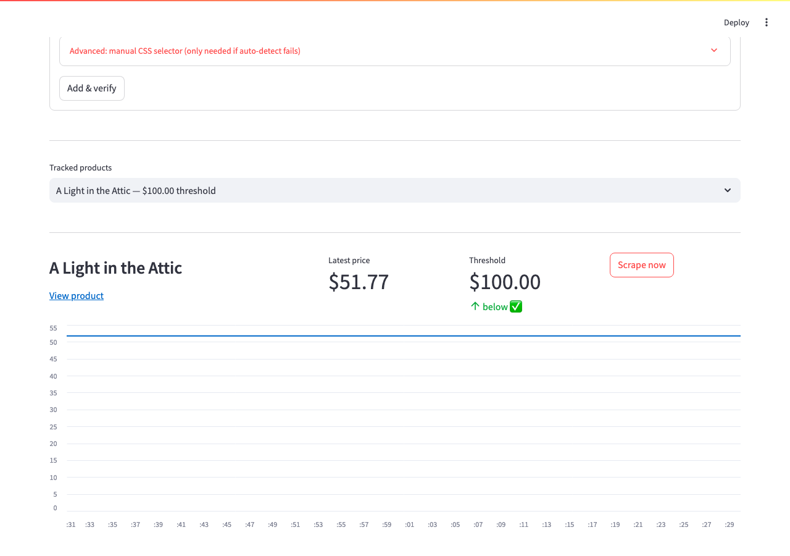

# Price Drop Tracker

Track the price of anything on the internet — a shirt on Lululemon, sneakers
on StockX, a textbook, whatever — and get alerted when it drops below a
threshold you set.



## How it works

- **Add any product URL** through the Streamlit dashboard. No hardcoded
  product list — you paste a link and set a threshold.
- **Price detection is automatic.** The scraper tries, in order:
  1. an optional manual CSS selector you provide,
  2. JSON-LD `Product`/`Offer` structured data (most e-commerce sites embed
     this for SEO, even when the visible price is rendered by JavaScript),
  3. Open Graph / `itemprop="price"` meta tags,
  4. a heuristic scan for elements whose class name contains "price".
- **Every scrape is logged to SQLite** (`data/prices.db`, one `products`
  table + one `price_history` table).
- **`tracker.py`** re-scrapes every tracked product on a schedule and logs
  (and optionally emails) a clear alert the moment a price drops below its
  threshold.
- **`dashboard.py`** is a Streamlit app for adding products and viewing price
  history charts.

## Setup

Requires Python 3.11+.

```bash
python3 -m venv venv
source venv/bin/activate
pip install -r requirements.txt
```

> **If this folder lives in iCloud Drive** (as it does by default under
> `~/Library/Mobile Documents/com~apple~CloudDocs/...`), don't let the venv's
> thousands of small files sit there — macOS will eventually evict them to
> free space, and Python will hang trying to read a cloud-only placeholder.
> Create the real venv somewhere local instead and symlink it in:
> ```bash
> python3 -m venv ~/.venvs/pricedroptracker
> ln -s ~/.venvs/pricedroptracker venv
> pip install -r requirements.txt
> ```
> Everything else (`venv/bin/...`, `source venv/bin/activate`) works exactly
> the same through the symlink.

## Usage

### 1. Add products and browse history (dashboard)

```bash
streamlit run dashboard.py
```

Paste a product URL, give it a name (optional — auto-filled from the page
title) and a drop-alert threshold, and hit **Add & verify**. The app scrapes
the page immediately to confirm it can detect a price before saving.

### 2. Scrape once (for testing / cron)

```bash
python tracker.py --once
```

Scrapes every tracked product, stores the price, and prints a `*** PRICE
DROP ***` message to the console for anything below its threshold.

### 3. Run continuously

```bash
python tracker.py --loop
```

Polls all products every `POLL_INTERVAL_HOURS` (default 6; set via env var)
and repeats forever.

### Optional: email alerts

Off by default (console logging is always on). To enable, set before running
`tracker.py`:

```bash
export EMAIL_ENABLED=true
export SMTP_HOST=smtp.gmail.com
export SMTP_PORT=587
export SMTP_USERNAME=you@gmail.com
export SMTP_PASSWORD=your-app-password
export ALERT_EMAIL_TO=you@gmail.com
```

## Tests

```bash
pytest
```

Covers the currency parser (`"$1,299.00"` → `1299.0`, etc.) and each price
detection strategy against sample HTML.

## Known limitations

- **Static HTML only.** No JavaScript is executed, so a site whose price is
  rendered entirely client-side *and* has no JSON-LD/meta price data will
  fail to detect a price. You'll get a clear error in the dashboard when this
  happens — try the manual CSS selector field, or track a different URL.
- **Bot-protected sites.** Many large retailers (seen while building this:
  StockX, Etsy, Uniqlo, H&M, eBay) block plain HTTP requests with a 403 via
  Cloudflare/Akamai-style protection, independent of JS rendering. Smaller
  or less aggressively protected stores tend to work fine.
- **Selector drift.** A manually-entered CSS selector will break if the site
  redesigns its page. Not something this project tries to self-heal — just
  re-check the selector if a product stops updating.
- **Rate limiting.** Don't poll faster than a few times per hour per product;
  `POLL_INTERVAL_HOURS` defaults to 6.
